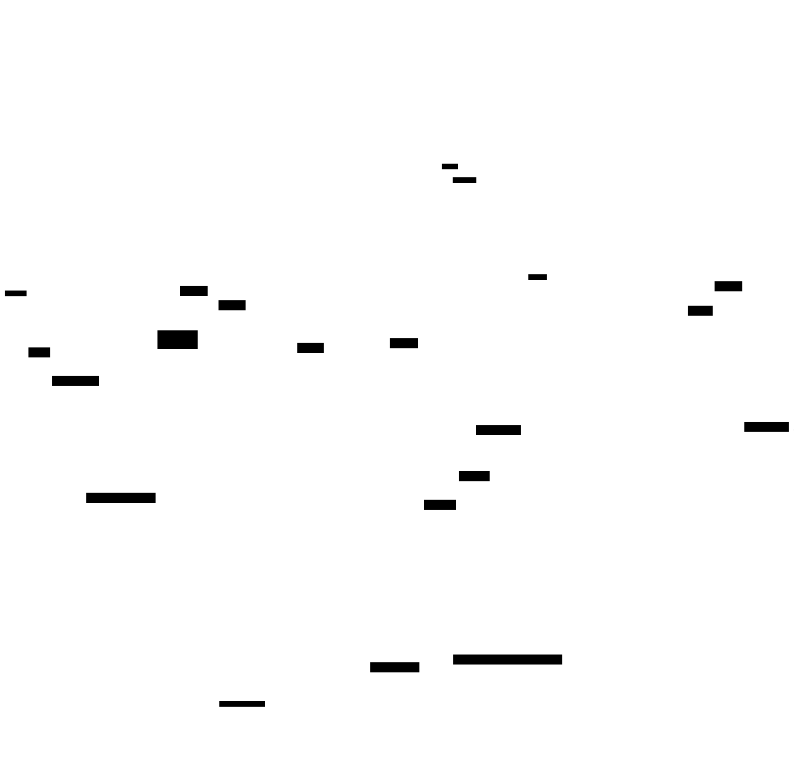

# Vocabulary Layering — the delegation pattern behind OpenEPCIS DPP-Ready

This project is organised as **four stacked layers**, each one delegating
cross-cutting concepts to the layer below. The result is that a new EU
regulation module typically adds only a handful of truly regulation-specific
terms, and a single change at a higher layer benefits every module above it.

<!-- Diagram source: diagrams/vocabulary-layering.d2 — regenerate with `pnpm run diagrams:build`. -->
<picture>
  <source media="(prefers-color-scheme: dark)" srcset="diagrams/vocabulary-layering-dark.svg">
  
</picture>

## How the vocabularies relate

The stack diagram above shows containment (which layer holds which
concept). The worked example below shows **how a term anchors upward**: a
single regulation-module property cascading through the shared core (`oec:`)
to the foundational and upstream vocabularies. The notable cases after it
generalise the same pattern.

<!-- Diagram source: diagrams/vocabulary-layering-relations.d2 — regenerate with `pnpm run diagrams:build`. -->
<picture>
  <source media="(prefers-color-scheme: dark)" srcset="diagrams/vocabulary-layering-relations-dark.svg">
  
</picture>

Reading the diagram:

- **Solid arrows** = structural relationships — `rdfs:subClassOf` or a property `range`.
- **Dashed arrows** = graded SKOS mapping relations (`skos:exactMatch` / `skos:closeMatch` / `skos:broadMatch`) or `rdfs:seeAlso` — semantic anchors that don't change the term's structural ancestry and don't assert OWL logical equivalence.

The example reads bottom-up: a module property (`eutex:spinningFacility`) ranges to the shared `oec:FacilityInformation`, and the upward anchors live on `oec:`, so every module facility property inherits the GS1, UNTP, and SEMICeu peers for free. The same delegation pattern produces a few other cases worth calling out:

1. **CCCEV → UNTP → `oec:`** is a real chain. UNTP's conformity model is itself derived from CCCEV (SEMICeu). When the project anchors `oec:DueDiligenceReport` to both `untp:` and `cccev:Evidence`, those two are upstream-of-upstream — anchoring to the EU foundation doesn't bypass UNTP, it adds a second canonical view of the same fact.
2. **`oec:OperatorInformation` is the textbook three-anchor case**: structurally a `gs1:Organization`, semantically equivalent to `untp:Party`, and an EU-portal peer of `cv:LegalEntity`. All three serialisations describe the same operator.
3. **`oec:HazardousSubstance` and similar CLP/REACH terms have no upstream peer.** Those `oec:` terms genuinely fill a gap and stay minted, with no upward anchor — deliberate, not an oversight.

## The delegation rule

When defining a new term, walk **downward** through the four layers. The
term goes in the **highest** layer that already covers it; only mint a new
IRI when no layer below already has it. Within Layer 1, check the three
foundational vocabularies in this order: **GS1 → SEMICeu → schema.org**.

| Decision | Action |
|---|---|
| Already in **GS1 Web Vocabulary** (`gs1:`) | Use it directly. GS1 is `owl:imports`-ed and is the canonical source for product / identifier / EPCIS-aligned attributes. |
| Already in **EU SEMICeu Core Vocabularies** (`cv:` / `cccev:` / `locn:` / `adms:` / `cpsv:`) | Use it directly **and** anchor any local alias upward via a graded SKOS mapping relation (`skos:exactMatch` / `skos:closeMatch` / `skos:broadMatch`), or `rdfs:subClassOf` where the local term is a true specialisation. SEMICeu is the EU-canonical source for public bodies, conformity (CCCEV), legal entities, persons, addresses, and identifier schemes. |
| Already in **schema.org** | Use it directly. schema.org is the universal-web fallback for ratings, observations, and generic metadata that GS1 and SEMICeu don't cover. |
| Already in UNTP / CIRPASS-2 / JTC 24 | Reference it directly **and** anchor any local alias upward. |
| Already in **GS1 Rail Vocabulary** (`rail:` — `https://gs1-epcis-reg.org/rail/voc/data#`) for railway-specific concepts | Use it directly. GS1 Rail is a **sectoral upstream profile (Layer 2)**, a sectoral peer to `gs1:` published by GS1 AISBL with GS1 Switzerland. Mirrored under `extensions/upstream/gs1-rail/`; cross-cutting overlaps (e.g. `rail:itemReconditioningDate` ↔ `oec:remanufacturingDate`) are bridged via `extensions/common/interop/context/rail-bridge-context.jsonld`. |
| Cross-cuts ≥2 regulations but absent upstream | Mint at `oec:` (common/core). |
| Specific to one regulation | Mint at the module namespace (`eu/<module>:`). |

**Conversely:** if you find yourself adding the same concept to two modules,
that's a signal it should move down to `oec:`. If a `oec:` term turns out
to be a SEMICeu / GS1 / schema.org duplicate, **redo and match upstream**:
either delete the `oec:` term in favour of the upstream IRI, or anchor
it via a graded SKOS mapping relation (`skos:exactMatch` / `skos:closeMatch` / `skos:broadMatch`) and prefer the
upstream IRI in JSON-LD serialisations.

## Why three foundational peers, not one

Each of GS1, SEMICeu, and schema.org owns a different slice of the DPP
data model and they only partially overlap. The order reflects how the
project actually consumes them:

- **GS1 Web Vocabulary** is the supply-chain authority and the imported
  foundation. It owns the identifier model (GTIN, GLN), the trade-item
  attribute set, and the EPCIS event integration that is the practical
  backbone of the project. Most product-side properties already live
  here, so checking GS1 first short-circuits most lookups.
- **EU SEMICeu Core Vocabularies** are the European Commission's
  reference vocabularies for public-sector data and fill the gaps GS1
  doesn't cover. CCCEV is upstream of UNTP's conformity model; CPOV /
  Core Business / Core Person / Core Location are the EU-canonical
  representations of public bodies, legal entities, natural persons,
  and addresses respectively. ADMS provides the identifier-scheme
  model that legal-entity IDs (LEI, EUID) plug into.
- **schema.org** is the universal-web fallback. Search engines, generic
  data tools, and most JSON-LD consumers recognise it out of the box.
  Best for ratings, observations, generic metadata, and concepts with
  broad web semantics (`Observation`, `QuantitativeValue`,
  `GeoCoordinates`) that neither GS1 nor SEMICeu has named explicitly.

Treating them as peers means a notified body is `cv:PublicOrganisation`
(not a stretched `gs1:Organization`), a declaration of conformity is
`cccev:Evidence` against a `cccev:Requirement` (not an opaque document
reference), and a product description still flows through `gs1:` /
`schema:` as before.

## Why this works

1. **Bridge-then-lift, not invent.** schema.org, GS1, SEMICeu, UNTP
   (UN/CEFACT) and CIRPASS-2 have done substantial work on cross-EU and
   cross-web data models. Where they have a term, we adopt it; the
   published IRIs (`schema:Product`, `gs1:gtin`,
   `http://data.europa.eu/m8g/PublicOrganisation`,
   `vocabulary.uncefact.org/untp/Party`, …) are canonical and
   tooling that recognises any of these vocabularies automatically
   understands our data.
2. **Module thinness drives audit clarity.** A reviewer looking at PPWR
   doesn't have to understand what packaging-specific recyclability means
   versus textile-specific recyclability — both reuse `oec:RecyclabilityAssessment`.
3. **A single change cascades.** Adding `oec:bioBasedFraction` once means
   PPWR, Detergent, and Textile can all express bio-based content
   identically without coordinating.
4. **Future EU regulations are cheap to add.** CPR, Right-to-Repair, ELV-
   revised, Toys-revised, Forced-Labour, CSDDD — research shows each
   needs ≤5 truly regulation-specific terms once the core is lifted.

## Mature regulations and what's needed for them

| Regulation | Status | Net new module terms (estimate) |
|---|---|---|
| Battery 2023/1542 | ✅ shipped (`eu/battery`) | 0 (mature) |
| EUDR 2023/1115 | ✅ shipped (`eu/eudr`) | 0 (mature) |
| Sustainable Textiles | ✅ shipped (`eu/textile`) | 0 (mature) |
| ESPR Electronics DA | ✅ shipped (`eu/electronics`) | 0 (mature) |
| Detergents 2026/405 | ✅ shipped (`eu/detergent`) | 0 (mature) |
| **PPWR 2025/40** | ✅ shipped (`eu/ppwr`, v0.1.0) | 4 (Packaging, packagingTier, recyclabilityGrade, harmonisedSymbol) |
| **CPR 2024/3110** | ✅ shipped (`eu/cpr`, v0.1.0) | 5 (ConstructionProduct, constructionProductType enum, reactionToFireClass enum, declarationOfPerformanceUrl, EssentialCharacteristic) |
| **Right-to-Repair 2024/1799** | ✅ shipped (oec: enrichment) | 0 — enriches `oec:RepairabilityInfo` with `oec:repairInformationPortalUrl` and `oec:RepairProvider` class |
| **CSDDD 2024/1760** | ✅ shipped (oec: enrichment) | 0 — enriches `oec:DueDiligenceReport` with `oec:dueDiligenceRegulationContext` and `oec:supplyChainTransparencyUrl` |
| **Forced Labour 2024/3015** | ✅ shipped (oec: enrichment) | 0 — enriches `oec:DueDiligenceReport` with `oec:forcedLabourFreeAssertion` |
| **CRMA 2024/1252** | ✅ shipped (oec: enrichment) | 0 — enriches `oec:MaterialComposition` with `oec:isStrategicRawMaterial` and `oec:crmListVersion` |
| FSMA 204 (US) | ✅ shipped (`us/fsma204`) | 0 (mature) |
| End-of-Life Vehicles (revision) | when adopted | ~5 |
| Toys Safety (revision) | when adopted | ~5 |

## Genuine `oec:` gaps — what we minted, why no upstream had it

CIRPASS-2 D3.2 (April 2025) confirmed three concepts as gaps in published
vocabulary; we minted them at `oec:`:

1. **Extended Producer Responsibility** (`oec:ExtendedProducerResponsibility`) —
   national EPR registries vary per Member State; no single international
   vocabulary covers them.
2. **Compostability + Biodegradability + Bio-based** (`oec:Compostability`,
   `oec:Biodegradability`, `oec:bioBasedFraction`) — distinct concepts often
   conflated; references to EN 13432, OK-Compost-Home, ASTM D6400, ISO 14593,
   OECD 301B/D/F.
3. **Deposit-Return Scheme** (`oec:DepositReturnScheme`) — national / planned
   EU-harmonised schemes; no upstream vocabulary.

Everything else delegates upward.

## Where to read this in code

- `extensions/common/core/ontology/dpp-core.ttl` — the `oec:` definitions
  with graded SKOS mapping relations (`skos:exactMatch` / `skos:closeMatch` / `skos:broadMatch`) to GS1,
  schema.org, SEMICeu Core Vocabularies, and UNTP.
- `extensions/common/interop/context/semic-core-bridge-context.jsonld` —
  the term-by-term bridge between our JSON-LD aliases and the SEMICeu
  Core Vocabularies (CCCEV, CPOV, Core Business / Person / Location,
  Core Public Event, CPSV-AP, ADMS-AP).
- `extensions/common/interop/context/untp-bridge-context.jsonld` — the
  authoritative term-by-term bridge between our ergonomic JSON-LD aliases
  and UNTP IRIs.
- `extensions/common/interop/docs/SEMIC_CORE_VOCABULARIES.md` — the
  canonical reference for how SEMICeu Core Vocabularies are integrated
  and which `oec:` / module terms anchor to them.
- `extensions/common/core/docs/PATTERNS.md` — full pattern reference for
  implementers.

## Where to read this in the published vocabulary browser

<https://ref.openepcis.io/extensions/> — region landing pages
(`/eu`, `/us`, `/common`) list each module with a short description that
states what it delegates to `oec:`. Each `oec:` term page shows its
SKOS mapping (`skos:exactMatch` / `skos:closeMatch` / `skos:broadMatch`) upward links to schema.org,
GS1, SEMICeu (`http://data.europa.eu/m8g/...`), and UNTP.
