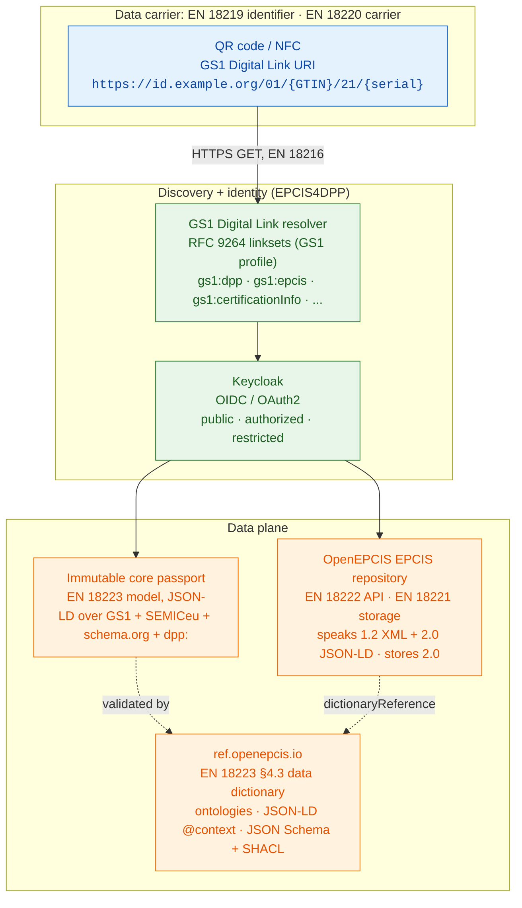
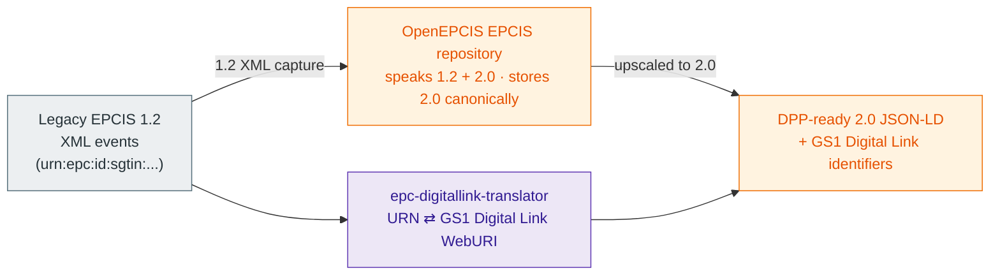
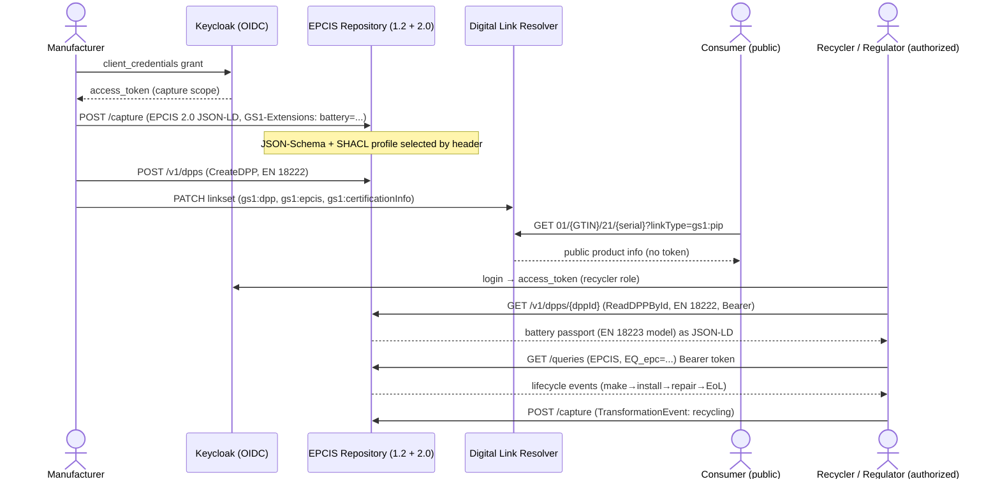

# EPCIS4DPP: a GS1 and EPCIS profile for the CEN/CENELEC Digital Product Passport standards

### One path to ESPR compliance: a complete, running, open-source profile that is conformant to the GS1 standards and realises the neutral CEN/CENELEC JTC 24 Digital Product Passport standards. The GS1 Digital Link resolver, an EPCIS repository that speaks EPCIS 1.2 and 2.0, ref.openepcis.io for semantics and validation, and Keycloak for identity.

**An OpenEPCIS DPP-Ready whitepaper · GS1 Standards Stack Scenario**

---

## Executive summary

In 2026, CEN/CENELEC Joint Technical Committee 24 published the first six
European standards for the Digital Product Passport (DPP) under
Standardisation Request M/604, the technical backbone of the Ecodesign
for Sustainable Products Regulation (ESPR, Regulation (EU)
2024/1781).[^espr] They are EN 18216 (data exchange protocols),[^en18216]
EN 18219 (unique identifiers),[^en18219] EN 18220 (data
carriers),[^en18220] EN 18221 (data storage, archiving and
persistence),[^en18221] EN 18222 (APIs for lifecycle management and
searchability),[^en18222] and EN 18223 (system
interoperability).[^en18223]

A central finding shapes this paper: **the standards are deliberately
technology- and scheme-neutral.** EN 18219 admits five identifier
schemes; EN 18220 admits several data carriers; EN 18223 mandates a
UML and JSON information model without prescribing any semantic-web
technology. They define *what* a conformant DPP system must do and leave
*how* to the implementer.

**Terminology.** *Compliance* denotes meeting a regulatory requirement
(ESPR, the Battery Regulation).[^battery] *Conformance* denotes adherence
to a published standard (a CEN/CENELEC DPP standard, or a GS1 standard
such as GS1 Digital Link[^digitallink] or EPCIS 2.0[^epcis]). An
implementer reaches regulatory compliance by operating a system that is
conformant to these published standards. Several conformant architectures
are possible.

**EPCIS4DPP** is the OpenEPCIS profile described here: one fully-worked,
conformant way to realise the neutral CEN models with GS1 and EPCIS. It
binds them to concrete choices, each of which the standards permit rather
than require:

- **GS1 identifiers** (EN 18219 scheme): GTIN, GLN, GTIN + serial.
- **A GS1 Digital Link data carrier** (an EN 18220 carrier): a QR code
  resolved by a GS1 Digital Link resolver.
- **The OpenEPCIS EPCIS repository** for capture, storage and query,
  speaking EPCIS 1.2 (XML) and EPCIS 2.0 (JSON and JSON-LD) and storing
  canonically in 2.0.[^repo]
- **ref.openepcis.io** as the EN 18223 §4.3 data-dictionary repository,
  publishing the ontologies, JSON-LD contexts, and JSON Schema and SHACL
  profiles.[^refregistry]
- **Keycloak** (OIDC / OAuth2) for identity and tiered access.[^keycloak]

The strongest accurate alignment: EN 18223's `DigitalProductPassport`
model maps almost one-to-one onto our `dpp:` core, and its decoupled
"data-dictionary repository" with `dictionaryReference` pointers is
exactly what ref.openepcis.io provides.

**Scope.** This paper follows the published GS1 and CEN/CENELEC standards
and offers an independent engineering account; it is not official GS1 or
CEN/CENELEC guidance, and EPCIS4DPP is one route among several. A
clause-by-clause conformance map is in
[`CEN_JTC24_CONFORMANCE.md`](./CEN_JTC24_CONFORMANCE.md), and the
ontology and API alignment work list is in
[`EN18223_MODEL_ALIGNMENT.md`](./EN18223_MODEL_ALIGNMENT.md). OpenEPCIS
DPP-Ready is at Preview v0.9.6; the runtime components it targets are
production projects of the OpenEPCIS community. The CEN standards are
licensed documents, cited here by clause.

---

## 1. The standards, and how to read them

JTC 24 is developing eight DPP standards under M/604. Six were published
in 2026; prEN 18239 (access rights) and prEN 18246 (data authentication)
remain in development.

| Standard | Title | Working Group |
|----------|-------|---------------|
| **EN 18219** | Unique identifiers | WG 2 |
| **EN 18220** | Data carriers | WG 2 |
| **EN 18216** | Data exchange protocols | WG 4 |
| **EN 18221** | Data storage, archiving and data persistence | WG 4 |
| **EN 18222** | APIs for the product passport lifecycle management and searchability | WG 4 |
| **EN 18223** | System interoperability | WG 4 |

Each standard sets requirements and leaves implementation open. EN 18219
lists five permissible identifier schemes (GS1 being one); EN 18220 lists
several carriers (QR, Data Matrix, RFID, NFC); EN 18216 fixes the
transport (HTTPS, JSON, content negotiation) but not the payload;
EN 18222 defines an abstract API method set; EN 18223 defines a
JSON information model and a decoupled data dictionary. EPCIS4DPP selects
one coherent set of choices across all six.

**Immutable core and dynamic lifecycle log.** EPCIS4DPP separates the
manufacturer's declared, versioned core passport from the stream of
lifecycle events that accrue as the item is made, shipped, repaired,
resold, and recycled. This is an EPCIS4DPP design pattern. EN 18221 is
storage-technology-neutral and neither requires nor forbids it.

**Why now.** The EU Battery Regulation (2023/1542) requires DPPs from
February 2027.[^battery] The EU DPP Registry goes live in July 2026, and
customs clearance will depend on a registered DPP once each
product-specific Delegated Act applies. Implementers cannot wait for all
eight standards to close, and with this profile they do not need to.

---

## 2. The EPCIS4DPP stack

Four components, each realising one or more of the neutral standards.



**GS1 Digital Link resolver.** A GS1 Digital Link URI in the product's QR
code is the passport's address. An `HTTPS GET` returns the passport and
related resources. The resolver, RFC 9264 linksets,[^rfc9264] and GS1 Web
Vocabulary link types are GS1 mechanisms; EN 18220 specifies the carrier,
not the resolver, so these are EPCIS4DPP profile choices. Section 5
details it.

**OpenEPCIS EPCIS repository.** It captures, stores and serves the
lifecycle as visibility events, speaking EPCIS 1.2 (XML) and EPCIS 2.0
(JSON and JSON-LD) and storing canonically in 2.0, built on Quarkus,
Apache Kafka and OpenSearch on Java 21.[^repo] It is where the EN 18222
API and EN 18221 storage requirements are met. Sections 3, 4 detail it.

**ref.openepcis.io.** The semantic registry, and the EN 18223 §4.3
data-dictionary repository: every class, property and JSON-LD context is
published with stable, dereferenceable URIs that serve as
`dictionaryReference` values, alongside the JSON Schema and SHACL
profiles.[^refregistry] Section 7 details it.

**Keycloak.** Identity in front of capture and of non-public resources,
realising the differentiated access ESPR requires.[^keycloak] The access
standard prEN 18239 is still in development. Section 6 details it.

---

## 3. One repository that speaks EPCIS 1.2 and 2.0

A large installed base captures visibility events as EPCIS 1.2 XML with
URN identifiers. DPP work expects EPCIS 2.0 JSON-LD with GS1 Digital Link
identifiers. The OpenEPCIS EPCIS repository speaks both at its interfaces
and stores canonically in 2.0, so an existing EPCIS deployment reaches
DPP readiness incrementally.



The repository accepts EPCIS 1.2 XML at capture, upscales it to 2.0 for
canonical storage, and serves events back as 1.2 or 2.0. Two libraries
provide the same conversions outside the repository:
`openepcis-document-converter` (EPCIS 1.2 XML to 2.0 JSON-LD, including
user extensions and sensor elements)[^converter] and
`openepcis-epc-digitallink-translator` (EPC URN to GS1 Digital Link Web
URI across fifteen-plus key types).[^translator]

This dual-serialisation capability supports conformance to EN 18216
(JSON and XML over the same transport) and EN 18219 (URN and Digital Link
identifiers reconciled). EPCIS itself is an EPCIS4DPP layer; EN 18216
does not mention it.

---

## 4. The EPCIS repository: lifecycle log and EN 18222 API

The repository holds the record of what happened to an item, and is where
EPCIS4DPP meets EN 18221 (storage and archiving) and EN 18222 (the API).

**Event coverage (EPCIS4DPP).** OpenEPCIS exercises the full EPCIS 2.0
surface: `ObjectEvent`, `TransformationEvent`, `AggregationEvent`, and
sensor reports, with business steps and dispositions taken verbatim from
the GS1 Core Business Vocabulary (CBV 2.0, ISO/IEC 19988:2024).[^cbv]

**Storage and archiving (EN 18221).** The repository persists events
append-only; the immutable-core passport is versioned. This is a
conformant implementation pattern for the EN 18221 requirements
(archiving from first change, retrieval of historical versions,
integrity), which the standard states in a storage-neutral way. The
EN 18221 roles (main and back-up DPP service provider), the Recovery
Point Objective, and OAIS (ISO 14721)[^oais] archival are tracked for
implementation.

**The EN 18222 API.** The standard defines a concrete DPP REST API
(`ReadDPPById`, `ReadDPPByProductId`, `ReadDPPVersionByIdAndDate`,
`ReadDPPIdsByProductIds`, `CreateDPP`, `UpdateDPPById`, `DeleteDPPById`,
element-level read and update by RFC 9535 JSONPath,[^rfc9535] and
`RegisterProductDPP` at the registry). EPCIS4DPP exposes this method set
over the repository; the method-to-endpoint plan is in
[`EN18223_MODEL_ALIGNMENT.md`](./EN18223_MODEL_ALIGNMENT.md).

**Validation at capture.** The `GS1-Extensions` HTTP header (EPCIS 2.0
§12.3) declares which extension namespaces a payload uses; the repository
then validates against the JSON Schema and SHACL profiles published under
each namespace at ref.openepcis.io.

```http
POST /capture HTTP/1.1
Content-Type: application/ld+json
GS1-Extensions: dpp=https://ref.openepcis.io/extensions/common/core/, battery=https://ref.openepcis.io/extensions/eu/battery/
Authorization: Bearer <access_token>
```

**Beyond EN 18222.** The standard's "searchability" is product-id
discovery with pagination. EPCIS4DPP adds the EPCIS 2.0 query interface
(search by EPC, business step, disposition, location, time) for the
lifecycle event log, as a profile addition alongside the EN 18222 API.

---

## 5. The GS1 Digital Link resolver (EPCIS4DPP discovery layer)

EN 18220 specifies the data carrier: a carrier shall encode a unique
product identifier that allows access to the DPP, and the standard admits
QR (ISO/IEC 18004),[^iso18004] Data Matrix, HF RFID, NFC and RAIN RFID as
equally valid carriers, with print-quality, OCR-B human-readable
interpretation, placement, and a DPP recognition marker. It does not
mention resolvers, RFC 9264 linksets, or link types.

EPCIS4DPP chooses a QR code carrying a GS1 Digital Link URI, with NFC
carrying the same URI as a supplementary carrier, resolved by a GS1
Digital Link resolver that OpenEPCIS operates in its reference deployment
(the `dev` environment driven by this repository's
`bruno/digital-link-resolver` collection). The resolver answers with an
RFC 9264 linkset of typed links, each tagged with a GS1 Web Vocabulary
link type:[^webvoc]

| `linkType` | Resource returned |
|------------|-------------------|
| `gs1:dpp` | Digital Product Passport (`gs1:Product` + domain type) |
| `gs1:pip` | Product information page (consumer view) |
| `gs1:epcis` | EPCIS query document (the lifecycle log) |
| `gs1:certificationInfo` | `gs1:CertificationDetails` |
| `gs1:sustainabilityInfo` | Carbon footprint, recycled content, recyclability |
| `gs1:traceability` | Geolocation and supply-chain view |
| `gs1:safetyInfo`, `gs1:instructions`, `gs1:serviceInfo`, `gs1:recallStatus`, `gs1:registryEntry` | safety, manuals, service, recalls, register |

Content negotiation (per EN 18216) serves the same identifier as HTML to
a phone, JSON-LD to a machine, or RDF Turtle. These resolver and linkset
mechanisms are an **EPCIS4DPP profile, beyond the standard**: EN 18220
specifies the carrier, and EPCIS4DPP adds the GS1 resolution layer on top.

---

## 6. Identity and access with Keycloak

ESPR requires differentiated access to passport data: some is public,
some is limited to authorized parties (repairers, recyclers, customs),
and some is restricted. EPCIS4DPP expresses these tiers with
`dpp:AccessLevel` (Public, AuthorizedOnly, Restricted) and enforces them
with Keycloak in front of the resolver and the repository.[^keycloak] The
reference deployment runs Keycloak with OAuth2; the Bruno collection
authenticates with an OAuth2 client and bearer tokens.

- **Capture is authenticated:** writing events requires a token with a
  capture scope (OAuth2 client-credentials grant).
- **Public reads need no token:** the `gs1:pip` consumer view resolves
  for anyone, supporting anonymous consumer access from a phone scan.
- **Authorized and restricted reads carry a bearer token** keyed to a
  Keycloak role (consumer, regulator, recycler, repairer, customs).

This realises ESPR's access requirement today. The dedicated CEN standard
for access rights, prEN 18239, is still in development; its data
authentication companion is prEN 18246. EPCIS4DPP will track both.

---

## 7. The semantic layer: ref.openepcis.io and EN 18223

EN 18223 is the interoperability standard, and the one EPCIS4DPP fits
most precisely. It names three interoperability levels (organisational,
semantic, technical) and mandates a **UML class model with a plain-JSON
serialisation**. It does not prescribe JSON-LD, RDF, OWL, or SHACL.

**The information model.** `DigitalProductPassport` carries
`digitalProductPassportId`, `uniqueProductIdentifier` (per EN 18219),
`granularity` (model/batch/item), `dppSchemaVersion`, `dppStatus`,
`lastUpdated`, `economicOperatorId`, `facilityId`,
`contentSpecificationIds`, and any number of `DataElement`s
(`SingleValuedDataElement`, `MultiValuedDataElement`,
`MultiLanguageDataElement`, `RelatedResource`, `DataElementCollection`).
This maps almost one-to-one onto our `dpp:` core; the attribute-level
reconciliation is tracked in
[`EN18223_MODEL_ALIGNMENT.md`](./EN18223_MODEL_ALIGNMENT.md). In
EPCIS4DPP, `granularity` is derived from the GS1 Digital Link Application
Identifiers (`01/{gtin}` model, `01/{gtin}/10/{lot}` batch,
`01/{gtin}/21/{serial}` item).

**The decoupled data dictionary (§4.3).** EN 18223 keeps semantic
definitions out of the payload, in a repository that each data point
references through a `dictionaryReference`, where every definition has a
unique identifier and the model permits cross-catalogue mapping.
**ref.openepcis.io is exactly such a repository.** Our class and property
IRIs are valid `dictionaryReference` values, each unique and resolvable,
mapped to GS1, the EU SEMICeu Core Vocabularies, schema.org and UNTP via
`owl:equivalentClass` and `owl:equivalentProperty`.

**Our serialisation.** EPCIS4DPP uses JSON-LD, a valid JSON serialisation
of the EN 18223 model that additionally carries semantic links through
`@context`. JSON-LD is an EPCIS4DPP choice for the technical layer; the
standard requires only JSON. Each module ships a JSON Schema (draft
2020-12) and a SHACL shape graph; the `openepcis-event-sentry` validator
checks events against reusable profiles.[^sentry]

### Deriving the passport from a GS1 Digital Link

A GS1 Digital Link URI carries the product identity and, through its
Application Identifiers, the granularity. The primary key is the GTIN
(AI 01); adding a batch (AI 10) or a serial (AI 21) tells you which of the
three EN 18223 granularity levels applies:

| Digital Link path | Application Identifiers | EN 18223 granularity |
|---|---|---|
| `/01/{gtin}` | 01 (GTIN) | model |
| `/01/{gtin}/10/{lot}` | 01 + 10 (batch / lot) | batch |
| `/01/{gtin}/21/{serial}` | 01 + 21 (serial) | item |

The rest of the passport is a mechanical projection of good GS1 Web
Vocabulary JSON-LD. Each property in the source document becomes an EN
18223 `DataElement`: the property IRI is the `dictionaryReference`, the
ontology range is the `valueDataType`, and the value's shape selects the
`objectType` (a literal yields a `SingleValuedDataElement`, a quantity a
`DataElementCollection`, a document reference a `RelatedResource`). The
derivation runs per property with no per-product mapping written by hand;
the expanded passport falls out of the GS1 JSON-LD plus the ontology
ranges. The converter `scripts/derive-en18223.ts` implements this
projection, and the browser demo at
[`demos/en18223-converter/`](../../../../demos/en18223-converter/) runs it
live on the real product passports we ship for each delegated act (battery,
electronics, textile, deforestation, packaging, construction, detergent, food),
spanning item, batch, and model granularity. Clause-level rules are
in [`CEN_JTC24_CONFORMANCE.md`](./CEN_JTC24_CONFORMANCE.md) and
[`EN18223_MODEL_ALIGNMENT.md`](./EN18223_MODEL_ALIGNMENT.md).

The envelope is derived too, so the source document carries only genuine
product data. `uniqueProductIdentifier` is the Digital Link itself,
`granularity` comes from its Application Identifiers, `digitalProductPassportId`
defaults to that identity, `dppSchemaVersion` is `EN 18223:2026`, `dppStatus`
defaults to `active`, and `contentSpecificationIds` is computed from the
distinct `dictionaryReference` namespaces the payload actually uses, so the
declared content specifications always match the content present. Economic
operator and facility identifiers are themselves GS1 Digital Links (AI 417
for the party, AI 414 for the physical location), consistent with the product
key. An author may still state any of these explicitly to override the
default.

### Two routes to interoperability: an observation (EN 18223 and UNTP)

The two specifications reach interoperability by different routes, and the
contrast is instructive. UN/CEFACT's UN Transparency Protocol (UNTP) is
developed through the UN/CEFACT Open Development Process: it surveys the
open standards that already exist and reuses the best-fitting ones,
building on W3C Verifiable Credentials 2.0, Decentralized Identifiers,
JSON-LD, and the GS1 Digital Link and EPCIS 2.0 identifiers.[^untp-spec][^w3cvc]
Its intellectual property is owned by the United Nations and provided free
of charge for use by anyone.[^untp-faq] Meaning travels inline: a JSON-LD
`@context` binds every term to an openly published vocabulary, so a
consumer resolves semantics straight from the document.

EN 18223 comes from the CEN/CENELEC JTC 24 European consensus process, in
which national delegations and their mirror committees, with strong
industry-stakeholder participation, agree the text.[^cen-process] It
specifies a plain-JSON serialisation and keeps semantic definitions out of
the payload, reached out of band through a `dictionaryReference` into
separately governed data dictionaries. The EN documents are obtained for a
fee from the national standards bodies; CEN and CENELEC do not distribute
or sell standards directly.[^cen-fee] The design carries forward
established practice and serves the broad installed base that the committee
represents.

OpenEPCIS is built on the conviction that interoperability is served best
by freely accessible standards and open ontologies. EPCIS4DPP therefore
takes the UNTP-style path while remaining EN 18223 conformant: the
serialisation is JSON-LD over openly published vocabularies, and every
`dictionaryReference` resolves into the open ref.openepcis.io dictionary,
so an adopter can understand the same data using that open dictionary
alone.

---

## 8. Standard-by-standard conformance

Concise verdicts; the cited detail is in
[`CEN_JTC24_CONFORMANCE.md`](./CEN_JTC24_CONFORMANCE.md).

| Standard | What it defines | EPCIS4DPP realisation | Status |
|----------|-----------------|-----------------------|--------|
| **EN 18219** Identifiers | Requirements + 5 ID schemes; granularity model/batch/item | GS1 keys (one permitted scheme); granularity derived from GS1 AIs | Conformant |
| **EN 18220** Data carriers | Several carriers + carrier quality | QR + GS1 Digital Link, NFC supplementary; resolver/linksets are profile additions | Conformant |
| **EN 18216** Data exchange | HTTPS/TLS/HTTP-2 + JSON + content negotiation | JSON-LD and HTML over HTTPS; EPCIS reuses the transport | Conformant |
| **EN 18221** Storage | Archiving/persistence + provider roles, neutral on tech | Append-only EPCIS + versioned core (a conformant pattern); roles + OAIS tracked | Partial |
| **EN 18222** APIs | Concrete DPP REST API + registry | Expose the method surface (tracked); EPCIS query + resolver added | Planned |
| **EN 18223** Interoperability | UML+JSON model + data dictionary | `dpp:` core maps to it; ref.openepcis.io is the §4.3 dictionary | Conformant |

`dpp:passportStatus` currently enumerates Draft/Active/Updated/Withdrawn/
Archived/Suspended; EN 18223's example values are active/inactive/
archived/invalid (extensible by legal acts). Reconciliation is tracked in
the alignment spec.

---

## 9. End-to-end scenario: a battery passport through EPCIS4DPP

Following the `bruno/digital-link-resolver` collection against an EV
battery (GTIN `09521234000013`, serial `BAT2024-001`, NMC811, 75 kWh).
Battery DPP obligations apply from February 2027.



**Step 1. Identify (EN 18219).** GTIN `09521234000013` for the model,
serial `BAT2024-001` for the item; the GS1 Digital Link
`01/09521234000013/21/BAT2024-001` makes the granularity `item`.

**Step 2. Capture and create (EN 18222, EN 18221).** Authenticated via
Keycloak, the manufacturer captures an EPCIS 2.0 `ObjectEvent`
(`commissioning`) and creates the passport via `CreateDPP`. The
`GS1-Extensions` header selects the battery validation profile. A
producer migrating from EPCIS 1.2 captures XML directly; the repository
upscales it to 2.0.

**Step 3. Publish the linkset (EPCIS4DPP).** The manufacturer `PATCH`es
the resolver so the Digital Link routes to `gs1:dpp`, `gs1:epcis`,
`gs1:certificationInfo`, and more.

**Step 4. Consumer scan (public).** Following `gs1:pip` returns the
public product page with no token.

**Step 5. Read the passport (EN 18222, EN 18223).** A recycler, holding a
Keycloak token, calls `ReadDPPById`; the response is the EN 18223
`DigitalProductPassport`, serialised as JSON-LD:

```json
{
  "@context": [
    "https://ref.gs1.org/standards/epcis/epcis-context.jsonld",
    "https://ref.openepcis.io/extensions/common/core/dpp-core-context.jsonld",
    "https://ref.openepcis.io/extensions/eu/battery/battery-context.jsonld"
  ],
  "digitalProductPassportId": "https://id.example.org/dpp/09521234000013/BAT2024-001",
  "uniqueProductIdentifier": "https://id.example.org/01/09521234000013/21/BAT2024-001",
  "granularity": "item",
  "dppStatus": "active",
  "type": ["gs1:Product", "battery:Battery"],
  "battery:ratedCapacity": { "@type": "gs1:QuantitativeValue", "value": 75, "unitCode": "kWh" },
  "battery:stateOfHealth": 0.92,
  "dpp:recycledContent": 0.16
}
```

**Step 6. Query the lifecycle log (EPCIS4DPP).** Following `gs1:epcis`,
the recycler queries the repository for the item's append-only history.

**Step 7. Record end-of-life (EN 18221).** At recycling, a
`TransformationEvent` extends the archived lifecycle log.

One identifier drives the whole flow: public for the consumer,
authenticated for the recycler, and conformant to the published standards
in a single running system.

---

## 10. Deployment and tooling

- **Runtime.** The EPCIS repository is a Quarkus application backed by
  Apache Kafka and OpenSearch (indexing, query and storage) on Java 21,
  deployable with Docker or Podman.[^repo] The resolver and Keycloak
  complete the edge.
- **Environments.** This repository's Bruno collection targets `local`
  and the `dev` environment (Keycloak OAuth2), giving a reproducible
  end-to-end walkthrough.
- **Tools.** `openepcis-document-converter`,[^converter]
  `openepcis-epc-digitallink-translator`,[^translator]
  `openepcis-event-sentry`,[^sentry] and the OpenEPCIS Test Data
  Generator[^tools] are open-source.
- **Semantics.** ref.openepcis.io serves the ontologies, contexts and
  validation profiles, and is the EN 18223 §4.3 data dictionary.

The Community Edition components are Apache-2.0.

---

## 11. Conformance summary and honest gaps

Six of the eight JTC 24 standards are published; EPCIS4DPP is conformant
to them (with EN 18221 partial and EN 18222 the API tracked for
implementation). Two remain in development:

- **prEN 18239 (Access rights, security, business confidentiality).**
  `dpp:AccessLevel` plus Keycloak enforce the access tiers today;
  fine-grained per-role link policies expand as the standard finalises.
- **prEN 18246 (Data authentication, reliability, integrity).** `dpp:did`
  and `dpp:identityCredentialUrl` provide hooks; Verifiable Credentials
  and Electronically Signed Data Constructs follow the final text. This
  standard is referenced normatively by EN 18221 and EN 18223.

EPCIS4DPP is one conformant profile of neutral standards, not the only
one. Where it goes beyond a standard (the GS1 Digital Link resolver,
RFC 9264 linksets, GS1 link types, EPCIS events), the paper labels it as
a profile choice. OpenEPCIS DPP-Ready is Preview v0.9.6; the ontology and
API alignment to the EN 18223 model and the EN 18222 API is specified in
[`EN18223_MODEL_ALIGNMENT.md`](./EN18223_MODEL_ALIGNMENT.md) and staged
for implementation.

---

## Internal references

- [`CEN_JTC24_CONFORMANCE.md`](./CEN_JTC24_CONFORMANCE.md): clause-by-clause conformance map
- [`EN18223_MODEL_ALIGNMENT.md`](./EN18223_MODEL_ALIGNMENT.md): ontology + API alignment work list
- [`STANDARDS_ALIGNMENT.md`](./STANDARDS_ALIGNMENT.md), [`LINK_TYPES.md`](../../core/docs/LINK_TYPES.md), [`EPCIS_MASTERDATA_AND_EXTENSIONS.md`](../../core/docs/EPCIS_MASTERDATA_AND_EXTENSIONS.md), [`GS1_EXTENSIONS_HEADER.md`](../../core/docs/GS1_EXTENSIONS_HEADER.md), [`VOCABULARY_LAYERING.md`](../../../../docs/VOCABULARY_LAYERING.md)

---

*OpenEPCIS DPP-Ready · EPCIS4DPP · GS1 Standards Stack Scenario · 2026 · Apache-2.0*

[^espr]: Regulation (EU) 2024/1781 (Ecodesign for Sustainable Products Regulation), EUR-Lex: https://eur-lex.europa.eu/eli/reg/2024/1781/oj/eng
[^battery]: Regulation (EU) 2023/1542 (Batteries and waste batteries), EUR-Lex: https://eur-lex.europa.eu/eli/reg/2023/1542/oj/eng
[^en18216]: EN 18216:2026, "Digital product passport - Data exchange protocols" (CEN/CENELEC JTC 24). Published by CEN/CENELEC and adopted nationally; a licensed document, cited here by clause.
[^en18219]: EN 18219:2026, "Digital product passport - Unique identifiers" (CEN/CENELEC JTC 24). Licensed; cited by clause.
[^en18220]: EN 18220:2026, "Digital product passport - Data carriers" (CEN/CENELEC JTC 24). Licensed; cited by clause.
[^en18221]: EN 18221:2026, "Digital product passport - Data storage, archiving, and data persistence" (CEN/CENELEC JTC 24). Licensed; cited by clause.
[^en18222]: EN 18222:2026, "Digital Product Passport - Application Programming Interfaces (APIs) for the product passport lifecycle management and searchability" (CEN/CENELEC JTC 24). Licensed; cited by clause.
[^en18223]: EN 18223:2026, "Digital Product Passport - System interoperability" (CEN/CENELEC JTC 24). Licensed; cited by clause. As of 2026 the EN 182xx series is developed under M/604 and not yet cited in the EU Official Journal, so it does not yet confer a formal presumption of conformity with ESPR.
[^epcis]: EPCIS 2.0, published as ISO/IEC 19987:2024 (https://www.iso.org/standard/85557.html); GS1 EPCIS and CBV standards: https://ref.gs1.org/standards/epcis/
[^cbv]: Core Business Vocabulary (CBV) 2.0, published as ISO/IEC 19988:2024: https://www.iso.org/standard/85558.html
[^digitallink]: GS1 Digital Link standard: https://www.gs1.org/standards/gs1-digital-link
[^webvoc]: GS1 Web Vocabulary: https://www.gs1.org/voc/
[^rfc9264]: M. Wilde and H. Van de Sompel, "Linkset: Media Types and a Link Relation Type for Link Sets", RFC 9264, IETF, November 2022: https://www.rfc-editor.org/info/rfc9264 (a GS1/EPCIS4DPP profile mechanism, not required by EN 18220)
[^rfc9535]: G. Normington et al., "JSONPath: Query Expressions for JSON", RFC 9535, IETF, February 2024: https://www.rfc-editor.org/info/rfc9535 (used by EN 18222 for element paths)
[^oais]: ISO 14721:2025, Open Archival Information System (OAIS) reference model: https://www.iso.org/standard/87471.html (referenced by EN 18221 for archiving)
[^iso18004]: ISO/IEC 18004:2024, QR Code bar code symbology specification: https://www.iso.org/standard/83389.html (referenced by EN 18220 for QR)
[^repo]: OpenEPCIS EPCIS Repository (Community Edition): https://github.com/openepcis/epcis-repository-ce ; documentation: https://openepcis.io/docs/
[^converter]: openepcis-document-converter (EPCIS 1.2 XML and 2.0 JSON-LD conversion): https://github.com/openepcis/openepcis-document-converter
[^translator]: openepcis-epc-digitallink-translator (EPC URN to GS1 Digital Link Web URI): https://github.com/openepcis/openepcis-epc-digitallink-translator
[^sentry]: openepcis-event-sentry (EPCIS event validation and profiles): https://github.com/openepcis/openepcis-event-sentry
[^tools]: OpenEPCIS tools and Test Data Generator: https://openepcis.io/docs/
[^keycloak]: Keycloak, open-source identity and access management (OIDC / OAuth2): https://www.keycloak.org/
[^refregistry]: OpenEPCIS DPP-Ready vocabulary registry: https://ref.openepcis.io
[^untp-spec]: UN Transparency Protocol (UNTP) specification, UN/CEFACT: https://untp.unece.org/docs/specification/ (built on W3C Verifiable Credentials, Decentralized Identifiers, JSON-LD, and the GS1 Digital Link / EPCIS 2.0 identifiers)
[^untp-faq]: UNTP FAQ, UN/CEFACT: https://untp.unece.org/docs/about/FAQ/ ("the UNTP intellectual property is owned by the United Nations and is provided free of charge for use by anyone"; developed through the UN/CEFACT Open Development Process)
[^w3cvc]: W3C Verifiable Credentials Data Model 2.0, W3C Recommendation: https://www.w3.org/TR/vc-data-model-2.0/
[^cen-process]: CEN/CENELEC, "European Standards": https://www.cencenelec.eu/european-standardization/european-standards/ (developed by consensus among national members through national delegations and mirror committees)
[^cen-fee]: CEN/CENELEC, "Obtaining European Standards": https://www.cencenelec.eu/european-standardization/european-standards/obtaining-european-standards/ ("CEN and CENELEC do not distribute or sell standards"; available for purchase from the national members)
